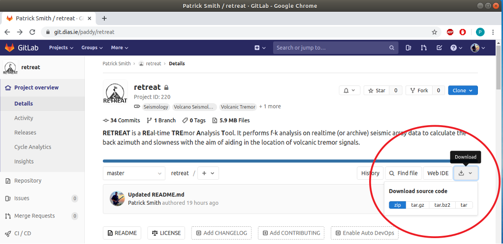
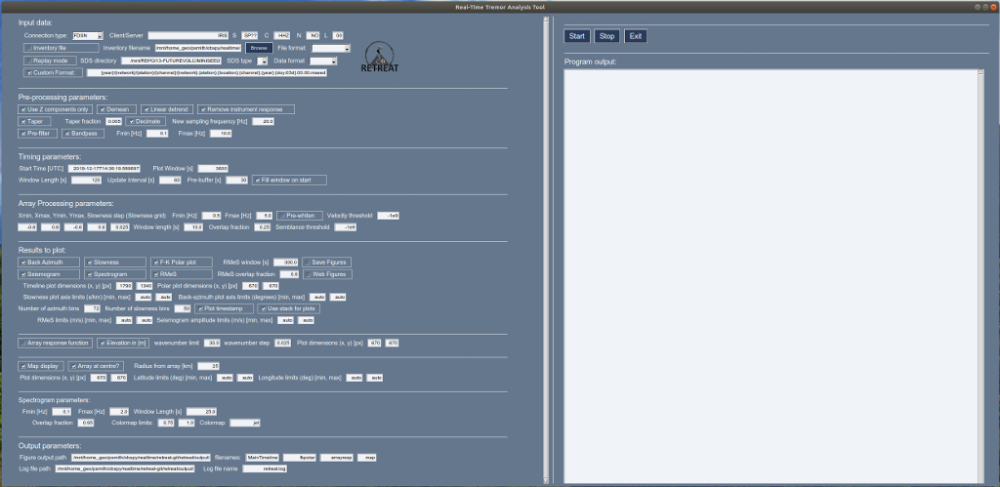
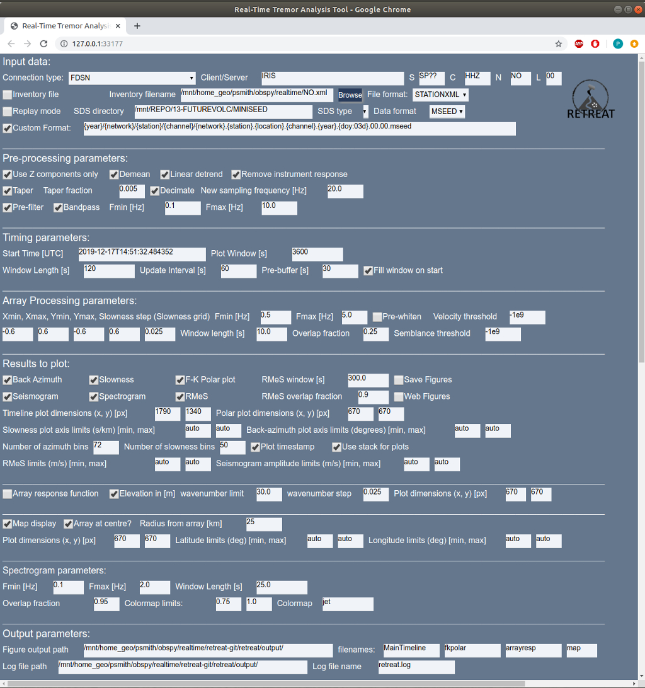
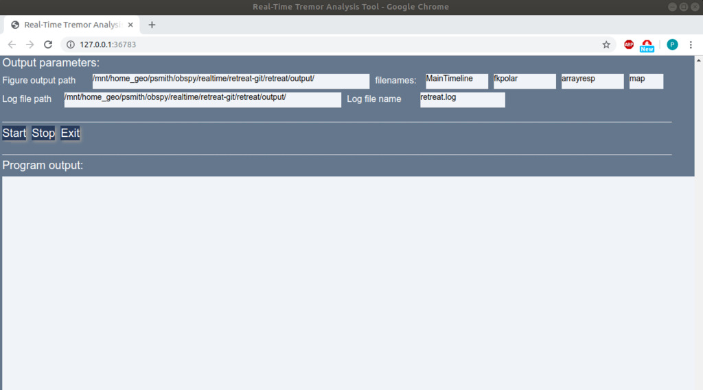
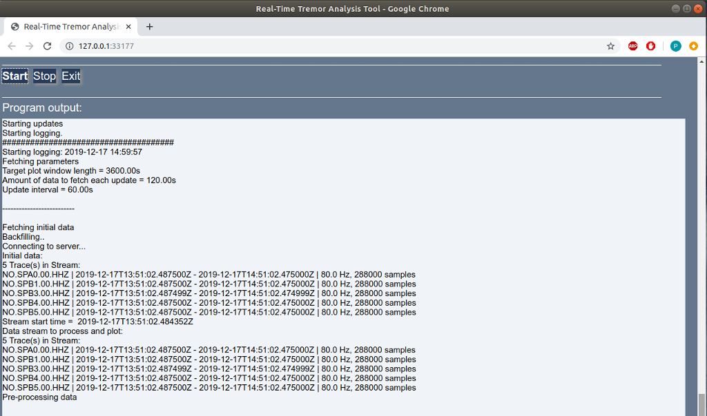
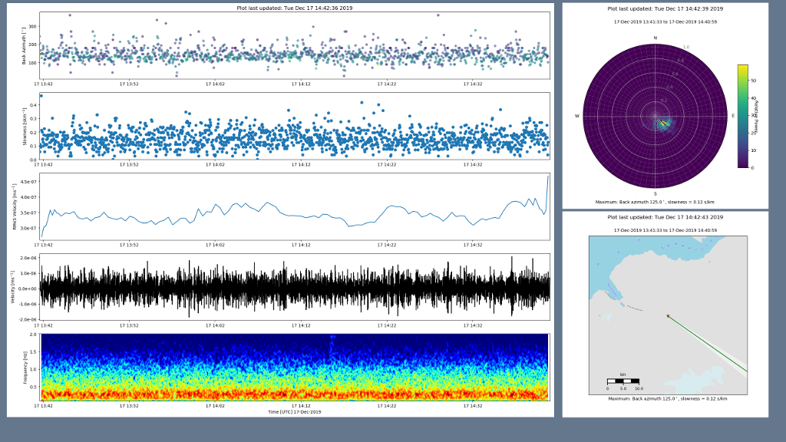
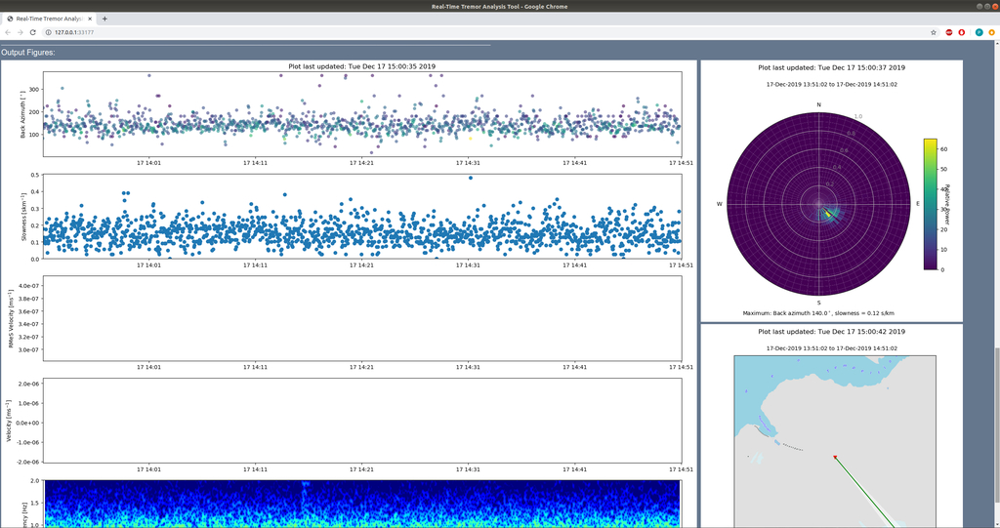
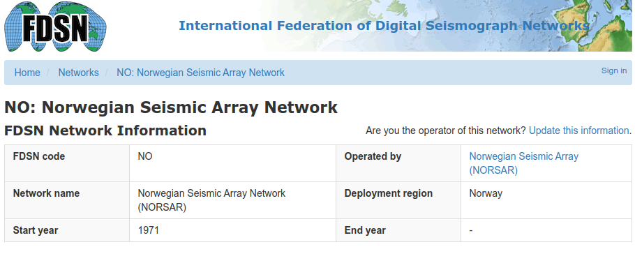

# RETREAT - *RE*al-time *TRE*mor *A*nalysis *T*ool
|||
|---|---|
|**RETREAT** is a **RE**al-time **TRE**mor **A**nalysis **T**ool written in python, making use of the [*obspy*](https://www.obspy.org/) framework. It performs frequency-wavenumber (f-k) analysis on realtime (or optionally archive) seismic array data to calculate the back azimuth and slowness values in a given time window, with the aim of aiding in the location of volcanic tremor signals.||

## Background 

The [EUROVOLC](https://eurovolc.eu/) project aims to promote an integrated and harmonised European volcanological community, and one of its main themes focuses on understanding sub-surface processes. Early identification of magma moving towards the surface is very important for mitigation of volcanic hazards, and joint research activities within the project aim to develop volcano pre-eruptive detection schemes. 

Volcanic tremor is a sustained seismic signal associated with eruptions and is often linked to movement of magmatic fluids in the subsurface. However, it can occur pre-, syn- and post-eruption, and signals with similar spectral content can be generated by several other processes (e.g. flooding, rockfalls). Hence one of the best ways of distinguishing between the processes underlying tremor generation is its 3D location. As tremor cannot be located using classical seismological methods, its source must be determined using alternatives such as amplitude-based techniques or seismic array analysis.

This software tool uses seismic array data and array processing techniques to help detect, quantify and locate volcanic tremor signals. It is a python-based tool that utilises existing routines from the open-source *obspy* framework to carry out analysis of seismic array data in real-time. The tool performs f-k (frequency-wavenumber) analysis using beamforming to calculate the back azimuth and slowness in overlapping time windows, which can be used to detect and track the location of volcanic tremor sources.

## Installation

#### Download

If you wish to use *git* you can download the latest version of the software by cloning the repository to a suitable location by typing:

>```git clone --recursive https://git.dias.ie/paddy/retreat```

Or alternatively click on the download button (at the top of the page, below the project description) to download the source code as a zip, tar or compressed archive file:



#### Setup

After you cloned or downloaded the software, navigate to the repository directory, or unzip/untar the source code to a suitable directory. The contents of the repository should look something like this:

```
retreat
├── doc
│   ├── DIAS_logo.jpg
│   ├── Eurovolc-header-1.jpg
│   ├── EUROVOLC-logo.jpg
│   ├── IRIS-NORSAR1.jpg
│   ├── IRIS-NORSAR2.jpg
│   ├── retreat_trans128.png
│   ├── retreat_trans192.png
│   ├── retreat_trans96.png
│   └── screenshots
│       ├── retreat-buttons.jpg
│       ├── retreat_GUI_figwindow.jpg
│       ├── retreat_GUI.jpg
│       ├── retreat_GUI_output.jpg
│       ├── retreat_WEB_bottom.jpg
│       ├── retreat_WEB_figwindow.jpg
│       ├── retreat_WEB_output.jpg
│       └── retreat_WEB_top.jpg
├── LICENSE.md
├── README.md
├── requirements.txt
└── retreat
    ├── data
    │   ├── array_preproc.py
    │   ├── fdsn2st3.py
    │   ├── fix_times.py
    │   ├── get_array_response.py
    │   ├── get_meta.py
    │   ├── __init__.py
    │   ├── sds2st3.py
    │   ├── slink2st3.py
    │   └── stack.py
    ├── defaults
    │   ├── default_input_values.py
    │   ├── default_input_values.py.NO
    │   ├── default_input_values.py.VI
    │   └── __init__.py
    ├── gui
    │   ├── get_param_gui.py
    │   ├── gui_layout.py
    │   ├── gui_sizes.py
    │   └── __init__.py
    ├── __init__.py
    ├── __main__.py
    ├── output
    ├── plot
    │   ├── __init__.py
    │   ├── mapping.py
    │   ├── rms_rmes.py
    │   └── update_plot.py
    ├── realtime.py
    ├── start.py
    ├── tools
    │   ├── __init__.py
    │   ├── KThread.py
    │   ├── monitoring_routines.py
    │   ├── processpool.py
    │   └── time_to_wait.py
    └── update.py
```

Next, check and install all the required software and packages.

#### Requirements

This software requires python3. A list of required python modules is contained in the _requirements.txt_ file.

These are:

- scipy (```python3-scipy```)
- matplotlib (```python3-matplotlib```)
- numpy (```python3-numpy```)
- pygtail (```python3-pygtail```)
- obspy (```python3-obspy```)
- psutil (```python3-psutil```)
- Pillow (```python3-pil```)
- PySimpleGUI
- PySimpleGUIWeb

More information on *obspy* and *PySimpleGUI* is available from:

[https://www.obspy.org/]() and [https://pysimplegui.readthedocs.io/en/latest/#install]()

Ubuntu/Debian package names are shown in brackets where available, and can be installed via: 

><code>sudo apt-get install *packagename*</code>

To install the required modules using **pip**, you can type the following:

>```pip3 install -r /path/to/requirements.txt```


Finally, to start the software follow the instructions below.

## Starting the software

The **RETREAT** package can be run in 2 modes:

1. With a GUI interface, running in its own window
2. With a web interface, where the input and output is displayed in a browser

### GUI window

This the default mode. In a terminal window navigate to the directory you cloned or downloaded to and type:

>```python3 -m retreat```

This will start the software and open a GUI window that should look something like this:



with the Input Parameters in the left hand pane, and the Control Buttons and Output Pane on the right hand side. 
Figures will appear in a *new window*.

### Web interface

To run the software with a web interface in a browser, do the same as above, but simply give the ``-w`` command line argument, i.e. :

>```python3 -m retreat -w```

This will start the software and open a new tab in your browser and should look like this:



with the Input Parameters listed at the top of the page,



and the Control Buttons and Output Pane visible below if you scroll down the page.
Figures will appear *below the Output Pane*.

## Description of Input Parameters

### Input Data

These parameters define the source and properties of the input data. The fields are:

* **Connection type** - Used for realtime data only. Can currently use the dropbox to choose from an FDSN or seedlink client.
* **Client/Server** - Details of the server for the chosen connection type. For FDSN this is simply the name, e.g. *IRIS*, and for Seedlink this is the server URL:port, e.g. *rtserve.iris.washington.edu:18000*
* **SCNL** - These specify the data Station, Channel, Network and Location codes for the input data (wildcard ? can be used)
* **Inventory file** - checkbox to specify if you are supplying an inventory or metadata file (required if Connection type is **not** FDSN or if using archive data)
* **Inventory filename** - Path and name of inventory file (you can also use the *Browse* button to select)
* **File format** - Specify format of inventory file. You can use all formats supported by *obspy* (including: STATIONXML, dataless SEED, XSEED or RESP)
* **Replay mode** - checkbox for for replay or archive data. Leave unchecked for real-time data.
* **SDS directory** - path to the root of an SDS (Seiscomp Directory Structure)
* **SDS type** - dropdown box to choose value for the *TYPE* field of the SDS
* **Data format** - format of the waveform data. You can use all formats supported by *obspy* (including: MSEED, SAC, SEISAN, GCF)
* **Custom Format** - checkbox to specify if you are using a non-standard SDS structure. If so, fill in your format in the box. Can be specified as {year}/{network}/{station}/{channel}/ etc. See the *obspy* [source code](https://docs.obspy.org/_modules/obspy/clients/filesystem/sds.html) for more details.

### Pre-processing

These parameters define any pre-processing applied to the data before the array analysis is carried out. The fields are:

* **Use Z-components only** - checkbox to select only vertical (Z) components from the stream (checked by default)
* **Demean** - checkbox to select whether to subtract the mean from each trace
* **Linear detrend** - checkbox to select whether to remove a linear trend from the data
* **Remove instrument response** - checkbox to select whether to remove the instrument response (output is velocity)
* **Taper** -  checkbox to select whether to apply a taper to the data
* **Taper fraction** - length of taper to apply (as a fraction of the window length)
* **Decimate** - checkbox to select whether to decimate or downsample the data (less data, speeds up array processing)
* **New sampling frequency** - specify the new sampling frequency to downsample to if the *Decimate* box is checked
* **Pre-filter**- checkbox to select whether to Pre-filter the data
* **Bandpass** - checkbox to select whether to Bandpass filter the data. The next 2 boxes specify the upper and lower frequency limits (in Hz) for the filter

### Timing

This set of parameters define the amount of data to be processed, by defining the length of the window and how often it is updated (real-time mode). The parameters are:

* **Start Time** -  specify the start time (UTC). This defaults to the current time (when software is started) when using real-time mode. It also accepts the keyword term '*now*'.
* **Plot window** - length of the window to be plotted in the output figure timeseries (in seconds)
* **Window length** - amount of data to fetch on each update (in seconds)
* **Update interval** - How often to update (fetch new data) - specified in seconds. If the processing for each update step takes longer than this update interval to complete, the software will warn you that realtime processing may lag. NOTE: for non-realtime/archive data this parameter is ignored and the next chunk of data is processed immediately.
* **Pre-buffer** - amount to pre-buffer (in seconds) before the start time to ensure there are no gaps in the data stream. This is only relevant for real-time mode
* **Fill window on start** - if this box is checked the software will fetch enough data to fill the entire window (specified by the *Plot window*) on the first update. Otherwise, it will fetch only *Window length* seconds and the window will grow with each update until it reaches the length of the *Plot Window*

### Array Processing parameters

Sets parameters for the array processing, using the standard *array_analysis* routines in *obspy*. See the *obspy* documentation [here](https://docs.obspy.org/packages/autogen/obspy.signal.array_analysis.array_processing.html#obspy.signal.array_analysis.array_processing). The choice of these values will depend very much on the specific array being used. 

* The first set of 5 values define the **slowness grid** over which to perform the beamforming. These are the minimum and maximum slowness values in the *x*- and *y*-directions, and the desired slowness step (or resolution).

The next 2 parameters define the bandpass filter limits:

* **Fmin** and **Fmax** - define the minimum and maximum frequency (in Hz) for the f-k analysis

To provide a timeseries output, the f-k analysis is performed by using shorter time windows and sliding these windows across the entire trace.

* **Window length** - defines the sliding window length (in seconds)
* **Overlap fraction** - defines the amount to overlap each window [0,1] (a higher value will increase the time resolution and hence processing time)

Other parameters:

* **Pre-whiten** - checkbox to select whether to Pre-whiten the data (unchecked/disabled by default)
* **Velocity threshold** - Threshold for velocity for f-k analysis
* **Semblance threshold** - Threshold for semblance for f-k analysis

Note on **coordinates**: although the *obspy* array_processing module accepts coordinates as either Cartesian (*xy*) or latitude and longitude (*lonlat*), for convenience in plotting the array response function and map of the array, please note that latitude and longitude (*lonlat*) format is assumed. Therefore, please ensure your station coordinates are specified as latitude and longitude in your station metadata/inventory file.
 
### Results and Plots

The parameters in this section define what you wish to plot as the output of the analysis as well as various settings for these figures. For more details and examples see the [Figures](#figures-and-output) section. The main timeseries figure can have up to 5 panels, with the desired output selected by the 5 checkboxes:

* **Back azimuth** - checkbox to select to plot a timeseries of the calculated back azimuths (in degrees)
* **Slowness** - checkbox to select to plot a timeseries of the calculated slowness (in s/km)
* **Seismogram** - checkbox to select to plot the (filtered) seismogram
* **Spectrogram** - checkbox to select to plot a spectrogram of the data
* **RMeS** - checkbox to select to plot the RMeS envelope (Root-Median-Square)

RMeS is the envelope of the seismogram calculated using a Root-Median-Square sliding window. The parameters than control this are:

* **RMeS Window** - length of the window to calculate RMeS in seconds
* **Overlap fraction** - defines the amount to overlap each window [0,1] (a higher value will increase the time resolution and hence processing time)

The 6th checkbox, **F-K Polar plot** creates a separate figure with the power from the f-k analysis represented in *Polar* form, with the *Back azimuth* on the *angular* axis, and the *slowness* on the *radial* axis.

* **Save figures** - checkbox to select whether to save each figure. If checked each update will save the figure as a NEW file with a unique filename based on the timestamp. Otherwise, if unchecked, the same image file is overwritten on each update.
* **Web Figures** - checkbox to select whether to display output figures in a web browser rather than a separate GUI window (**NOTE** this the default if the software is started in Web interface mode and cannot be changed)

The next set of parameters define the size of the output figures, as pairs of *x* and *y* values. The sizes are specified in *pixels* (resolution is set to 100 DPI):

* **Timeline plot dimensions** - size of main timeline figure (with up to 5 panels)
* **Polar plot dimensions** -  size of f-k polar form figure 

Fixed *y*-axis limits for the various figures can also be set. If set to *auto* the figure will automatically scale the axes:

* **Slowness plot axis limits** - minimum and maximum slowness values for the *y*-axis (in s/km)
* **Back-azimuth plot axis limits** - minimum and maximum azimuth values for the *y*-axis (in degrees)

You can also define the resolution for the histogram in the polar representation of the results:

* **Number of azimuth bins** - It is expected that 360 divided by this number is an integer
* **Number of slowness bins** - Higher values increase the resolution but take longer to process

Other options include:

* **Plot timestamp**  - if checked this will print the timestamp onto each figure (*current* time if in real-time mode OR stream start time if in archive mode)
* **Use stack for plots**  - if checked a *stack* of the traces in the array will be used as the *seismogram* plot. Otherwise the first station in the stream is used.
* **RMeS limits** - minimum and maximum velocity values for the RMeS panel *y*-axis (in m/s). If set to *auto* the figure will automatically scale the axes
* **Seismogram amplitude limits** - minimum and maximum velocity values for the *y*-axis (in m/s). Again, if set to *auto* the figure will automatically scale the axes

The next set of values control the (optional) plot of the array response function:

* **Array response function** - checkbox to select whether to produce a plot of the array response function. Note that *only one of* the array response function or map can be selected.

* **Elevation in [m]** - checkbox to determine if elevation values are given in metres. If unchecked elevation values in kilometres are assumed.

The wavenumber grid over which to evaluate the array response must also be defined:

* **wavenumber limit** - limit or maximum wavenumber to analyze (assumed symmetric grid: *-klim* to *+klim* in both *x* and *y*-directions)
* **wavenumber step** - wavenumber step or resolution of grid

see [here](https://docs.obspy.org/tutorial/code_snippets/array_response_function.html) for the *obspy* documentation and an example of plotting the array response function.

* **Plot dimensions** - size of the output figure (*x* and *y* values) specified in *pixels*.

The final set of values control the (optional) map of the array, overlain by the calculated back azimuths:

* **Map display** - checkbox to select whether to produce a map using data from [OpenTopoMap](https://wiki.openstreetmap.org/wiki/OpenTopoMap). A working internet connection is required to download the relevant tiles. Note that *only one of* the array response function or map can be selected.
* **Array at centre** - checkbox to select whether to have the array at the centre of the map
* **Radius from array** - If array is at the centre of the map, this value defines a radius (in km) to automatically determine the map extent.
* **Plot dimensions** - size of the map figure (*x* and *y* values) specified in *pixels*.

The *x*- and *y*-axis limits of the map extent can also be manually specified. If the array at centre checkbox is **NOT** checked, these values **MUST** given. Else, if set to *auto* the figure will automatically scale the axes.

* **Latitude limits** - manually specify the latitude axis limits (min, max) in degrees.
* **Longitude limits**- manually specify the latitude axis limits (min, max) in degrees.

If set to *auto* the figure will automatically scale the axes (for array at centre checked)
#### Spectrogram 

A separate section contains the settings for controlling the spectrogram figure (if selected to plot):

* **Fmin** - minimum limit for the frequency (*y*-) axis.
* **Fmax** - maximum limit for the frequency (*y*-) axis.

The length and overlap of the FFT window used are controlled by:

* **Window length** - length of the window to calculate FFT in seconds
* **Overlap fraction** - defines the amount to overlap each window [0,1]

The colormap and limits of the colour scale for the spectrogram are given by:

* **Colormap limits** - minimum and maximum values (normalised)
* **Colormap** - name of colormap to use for the spectrogram. For a list of colormaps available for matplotlib, see [https://matplotlib.org/3.1.0/tutorials/colors/colormaps.html](https://matplotlib.org/3.1.0/tutorials/colors/colormaps.html).

### Output

These settings control where the output produced by the software is placed on your system. The parameters are:

* **Figure output path** - full path to where to store output figures and plots. (default is: *retreat/output/*). The next 4 boxes are the **filenames** for the different output figures: *MainTimeline*, *fkpolar*, *arrayresp*, and *map* (in order). Note that if the **Save Figures** checkbox is selected (see above) then these names will be appended by a unique string based on the timestamp.

* **Log file path** - full path to where to store the logfile. The accompanying box specifies the log file **filename**.

### Default values

All parameters that can be set using the GUI or web interface can also be defined in advance of runtime. This is controlled by the **default_input_values.py** file in the *retreat/defaults* directory, which contains a simple python dictionary comprising of pairs of parameters and their default values. e.g:

```
defaults = dict(
        #########################
        # DATA SOURCES - REALTIME
        myclient="IRIS",
        connection=['FDSN', 'seedlink'],
        ...
        ...
        ...
        arrayfigname="arrayresp",
        mapfigname="map",
        ########################
    )
```
This file can be easily edited to change the default values as desired.

The repository also contains two examples files containing default values that can be used to run the two examples described in the [Examples](#examples) section. These are:

>```default_input_values.py.NO```

which contains values to run the *real-time* data example, using data from the SPITS/NORSAR (NO) array

and

>```default_input_values.py.VI```

which contains values to run the *archive* data example, using data from the B&aacute;r&eth;arbunga (VI) array.

## Control Buttons

There are 3 simple buttons to control the software:


* **Start** - pressing this will start the data acquisition (either real-time or from archive files), carry out the array processing, produce the output figures and then update/repeat as specified. This continues indefinitely until stopped.

* **Stop** - pressing this button stops the computation

* **Exit** - Closes the window and exits from the program

## Figures and Output

### Output window

In both GUI and web mode, the interface displays an output pane that shows the output produced once the **Start** button is pressed. The text displayed on screen is the same as the messages that are written to the log file. This is achieved using the *pygtail* module, which updates the output pane by printing log file lines that have not been read.



### Figure window

In both GUI and web mode, the interface also has a figure window that shows the output figures that are produced once the **Start** button is pressed.

In GUI mode this will open as a *new* window:



whereas in web mode, figures are displayed in the *same* browser window, *below* the output pane:



## Examples

Two example configuration files are included with the source code to demonstrate how the tool can be used for both real-time and archive data.

### 1. *Real-time* mode using data from SPITS array

The first example uses real-time data from the small-aperture SPITS array in Spitsbergen, part of the larger [NORSAR](https://www.fdsn.org/networks/detail/NO/) array:



Data is acquired in real-time from [IRIS](https://www.iris.edu/hq/) via the *obspy* [FDSN](https://docs.obspy.org/packages/obspy.clients.fdsn.html) client.

To run the example, simply copy the appropriate default values file (NO array) and overwrite the default values:

> ```cd retreat/defaults/```

>```cp default_input_values.py.NO default_input_values.py```

and [start](#starting-the-software) the software. This should begin analysis of real-time data, with results similar to those shown [here](#figure-window).

### 2. *Archive* mode using data from FUTUREVOLC

The second example uses archive data from the 2014 eruption at B&aacute;r&eth;arbunga volcano in Iceland, collected as part of the FUTUREVOLC project. Several hours of data from 03 September 2014 are included with the distribution. This corresponds to the time period analysed in [Eibl et al., (2017)](https://doi.org/10.1038/ngeo2906).

Again, to run this example, simply copy the appropriate default values file (VI array) and overwrite the default values:

> ```cd retreat/defaults/```

>```cp default_input_values.py.VI default_input_values.py```

and [start](#starting-the-software) the software. This should begin analysis of the archive data.

**CHECK - what can we make available here?? and HOW!?**

## References

Eibl, Eva P. S., Bean, C.J., Vogfjörd, K.S., Ying, Y., Lokmer, I., Möllhoff, M., O’Brien, G.S., & Pálsson, F.  (2017). Tremor-rich shallow dyke formation followed by silent magma flow at Bárðarbunga in Iceland. Nature Geoscience volume 10, pages 299–304, doi:[10.1038/ngeo2906](https://doi.org/10.1038/ngeo2906).

## Release History
* 0.0.1
    * First release. Work in progress

## Meta

Paddy Smith – psmith@cp.dias.ie
<!-- [@YourTwitter](https://twitter.com/dbader_org)-->


Distributed under the XYZ license. See ``LICENSE`` for more information.

[https://git.dias.ie/paddy/retreat](https://git.dias.ie/paddy/retreat)

This software was developed and made available as part of the **EUROVOLC** project. 

For more information see [https://eurovolc.cp.dias.ie/index.php](https://eurovolc.cp.dias.ie/index.php/Open_software)


<!--## Contributing-->

<!--1. Fork it (<https://github.com/yourname/yourproject/fork>)-->
<!--2. Create your feature branch (`git checkout -b feature/fooBar`)-->
<!--3. Commit your changes (`git commit -am 'Add some fooBar'`)-->
<!--4. Push to the branch (`git push origin feature/fooBar`)-->
<!--5. Create a new Pull Request-->

<!--<!-- Markdown link & img dfn's -->
<!--[npm-image]: https://img.shields.io/npm/v/datadog-metrics.svg?style=flat-square-->
<!--[npm-url]: https://npmjs.org/package/datadog-metrics-->
<!--[npm-downloads]: https://img.shields.io/npm/dm/datadog-metrics.svg?style=flat-square-->
<!--[travis-image]: https://img.shields.io/travis/dbader/node-datadog-metrics/master.svg?style=flat-square-->
<!--[travis-url]: https://travis-ci.org/dbader/node-datadog-metrics-->
<!--[wiki]: https://github.com/yourname/yourproject/wiki-->
